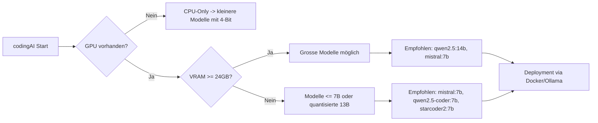

# Local LLM Setup
Version: experimental-0.21.1

Source of truth: `ai-agent/llm/provider.py`

## Provider modes

1. `LLM_PROVIDER=openai`
2. `LLM_PROVIDER=local`
3. `LLM_PROVIDER=auto` (tries providers in `LLM_PROVIDER_ORDER`)

Default: `LLM_PROVIDER=openai`, `LLM_PROVIDER_ORDER=local,openai` (so local is tried first when provider=auto).

## Required env for local mode

```bash
export LLM_PROVIDER=local
export LOCAL_LLM_BASE_URL=http://127.0.0.1:11434
export LOCAL_LLM_API_MODE=chat
export LOCAL_LLM_PROFILE=auto
export LOCAL_LLM_MODEL=mistral:7b
```

## Model recommendation matrix

For a 16GB GPU, use:

1. `mistral:7b` (Apache-2.0) for strong general quality at 7B size.
2. `qwen2.5-coder:7b` (Apache-2.0) for code-focused tasks.
3. `starcoder2:7b` (BigCode-Rail) for strong 7B coding performance.

Fallback for weak/no GPU:

1. `gpt-j:6b` (Apache-2.0), if available in your runtime.
2. `llama2:7b` as a practical CPU/GPU fallback option.

`scripts/setup_local_llm_ollama.sh` supports `auto` model selection:

- no NVIDIA GPU: `gpt-j:6b,llama2:7b,mistral:7b`
- GPU <24GB VRAM: `mistral:7b,qwen2.5-coder:7b,starcoder2:7b`
- GPU ≥24GB VRAM: `qwen2.5:14b,mistral:7b,qwen2.5-coder:7b`

You can override these with:

- `LOCAL_LLM_PROFILE` (`auto|gpu16|gpu24|cpu`)
- `LOCAL_LLM_CPU_CANDIDATES`
- `LOCAL_LLM_GPU16_CANDIDATES`
- `LOCAL_LLM_GPU24_CANDIDATES`

Decision flow:



## Current VM status (2026-02-22 UTC)

1. `http://127.0.0.1:11434/v1/models` is currently unreachable (no local model server running).
2. With default fallback enabled, runtime selects OpenAI when local health check fails.
3. If fallback is disabled and `LLM_PROVIDER=local`, agent readiness becomes `false` until local endpoint is healthy.

## Reliability controls

1. `LLM_FALLBACK_ENABLED=true`
2. `LLM_HEALTHCHECK_ENABLED=true`
3. `LLM_REQUIRE_HEALTHY=true`
4. `LLM_HEALTHCHECK_TIMEOUT_SECONDS=2.5`
5. `LLM_HEALTHCHECK_CACHE_SECONDS=45`

## Telemetry

1. `LLM_TELEMETRY_ENABLED=true`
2. `LLM_TELEMETRY_FILE` defaults to `paths.LOGS_DIR/llm_telemetry.jsonl`

Counters are also exposed in runtime state under `state["llm_runtime"]["telemetry_counters"]`.

## Ollama bootstrap

```bash
cd /home/codingai
scripts/setup_local_llm_ollama.sh auto
```

After bootstrap, validate:

```bash
curl -s http://127.0.0.1:11434/v1/models
```

Strict local-only validation (no fallback):

```bash
cd /tmp/codingai-localstate/ai-agent
PYTHONPATH=. LLM_PROVIDER=local LLM_FALLBACK_ENABLED=false LLM_REQUIRE_HEALTHY=true \
  /home/codingai/ai-agent/venv/bin/python -c "from llm.provider import ensure_llm_ready; print(ensure_llm_ready(force=True))"
```

## Notes

1. Strategy selection and patch generation share the same provider pipeline.
2. `LOCAL_LLM_API_MODE=responses` is supported for strict OpenAI-compatible local gateways.
3. Health/fallback decisions are cached briefly for performance.
